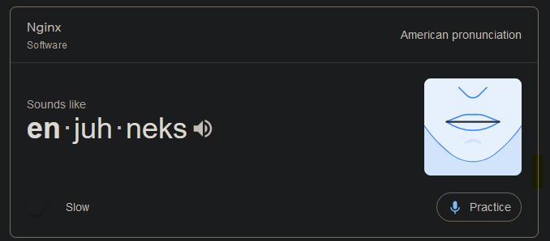

# Hectors Reading notes

## Ops Readings

### Web Server Deployment

1. Why this topic matters as it relates to what you are studying

- As ops professionals we will be working with web servers at some point in our career and it is a good idea to understand them.

1. What are some common use cases for NGINX?

- "NGINX is open source software for web serving, reverse proxying, caching, load balancing, media streaming" (NIGINX.com)

2. How does NGINX handle tasks that could slow down the web server?

- It acts as a middle man negotiating and compressing.

3. Describe, as if to a non-technical friend, how to actually pronounce “NGINX '', and why an org might choose to use it.

- 
- You can choose to use it because it is open source and you want more control over your stuff.

## Things I want to know more about

- What other services are out there?
 
## Resources

https://www.nginx.com/resources/glossary/nginx/
(Used for general understanding and quoted in the reading)

https://www.google.com/
(for the pronunciation)