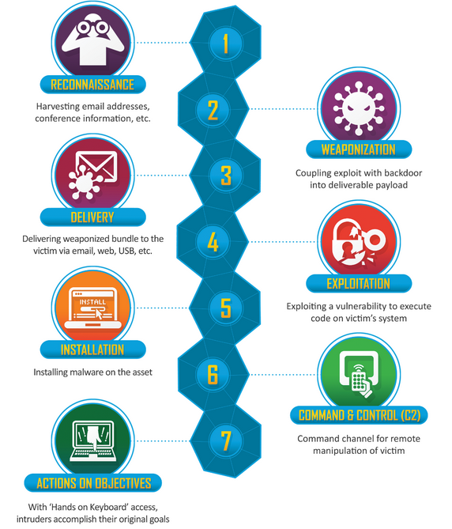

# Hectors Reading notes

## Ops Readings

### What is penetration testing?

1. Why this topic matters as it relates to what you are studying

- Penetration testing is just one of the ways to test your defenses and to keep yourself safe.

2. How are the stages of a pen test very similar to those of the Cyber Kill Chain?

 

3. Your manager has asked you to explain the benefits of a pentest to the company’s leadership. How would you lead this conversation?

- Pentesting is the confirmation and validation of all your security efforts. You can say things are done correctly and no one can get in but how do you know unless you try?

## Things I want to know more about

- Where can I start?

## Resources

- [Insider Tech](https://www.youtube.com/watch?v=pL9q2lOZ1Fw)

(Used for general understanding and quoted in the reading)