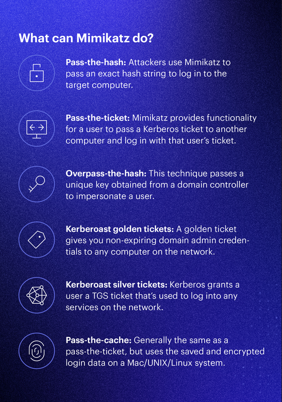
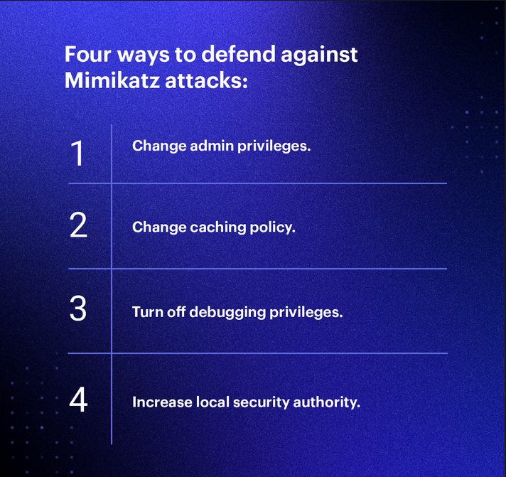

# Hectors Reading notes

## Ops Readings

### What is Mimikatz

1. Why this topic matters as it relates to what you are studying

- "Mimikatz is an open-source application that allows users to view and save authentication credentials such as Kerberos tickets."

(Varonis, 23MAR2024)

2. Name the six credential-gathering techniques which Mimikatz is able to perform and explain how two of them work.

3. What are four ways we can defend against Mimikatz attacks. Explain how two of the mitigations can stop Mimikatz.

## Things I want to know more about

- Where can I start?

## Resources

- [Varonis](https://www.varonis.com/blog/what-is-mimikatz)

(Used for general understanding and quoted in the reading)